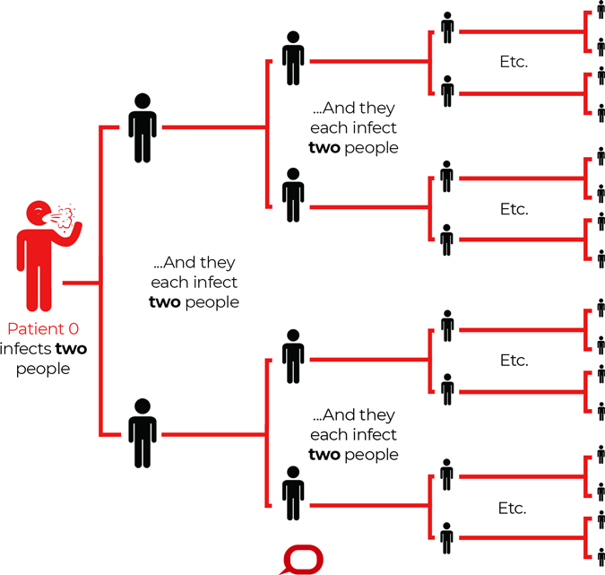

```{r setup, include=FALSE}
knitr::opts_chunk$set(echo = FALSE)
```

Recently I have read an [article](https://codeblue.galencentre.org/2020/11/27/malaysia-buying-pfizers-ultra-cold-covid-19-vaccine-posing-major-distribution-issues/#:~:text=According%20to%20BioSpace%2C%20the%20Covid,price%20sold%20to%20the%20US) that Malaysian government have made a deal with Pfizer for 6.4 million Malaysian to be vaccinated. So, I am wondering what is the minimal number of people should be vaccinated.

I have also come across this interesting [article](https://www.cebm.net/covid-19/when-will-it-be-over-an-introduction-to-viral-reproduction-numbers-r0-and-re/) which explains how we can calculate a minimal number of people to be vaccinated to achieved herd immunity based on R naught (R~0~).

**R naught (R~0~)**

The basic idea of R~0~ or basic reproduction number is quite simple. It describes how many secondary infection will derive from the first case. I think Figure 1 below describe this idea very well.

```{r, echo=FALSE, out.width='60%', fig.align='center', fig.cap="Basic idea of R~0~(image from https://www.atrainceu.com/content/3-basic-reproduction-number-r-naught)"}

```

So, R~0~ can be affected by a few factors such as:

* proportion of susceptible people at initial outbreak
* infectiousness of the virus or the disease
* rate of recovery or death
* and a few other factors

As R~0~ increases more than 1, the spread of the disease will increases, while R~0~ below 1 indicates the spread of the disease will decrease and eventually dies out.

However, I noticed that quite a few including KKM (Ministry of Health, Malaysia) have used the term R~0~ in their reports instead of R~e~ or R~t~ which is the effective reproduction number or time-varying reproduction number. R~0~ refers to the initial reproduction number at beginning of the outbreak. The "naught" or "zero" in R naught (R~0~) is referring to population condition that has zero immunity to the disease.

**Herd immunity**

Herd immunity is said to be occurred when a significant proportion of the population is immunized. Subsequently, those whose susceptible (not immunized) will be protected.

**How many should be vaccinated**

So, back to the initial topic. We can use the formula below to answer this question.

$$P_i > 1 - \frac{1}{R_0}$$

P~i~ refers to number of proportion that should be immunized or in this case vaccinated.

So, after googling I found one calculation by my lecturer in Biostat Unit, USM, [Dr Wan Arifin](https://wnarifin.github.io/) and his colleague. The R~0~ based on his [calculation](https://wnarifin.github.io/covid-19-malaysia-sir/) is 2.673. Also, I found another [article](https://codeblue.galencentre.org/2020/04/10/mco-slashed-malaysia-covid-19-infection-rate-by-over-three-times/) reported that the R~0~ is 3.55 in March according to KKM.

Malaysian's population is estimated at [32.7 million](https://www.dosm.gov.my/v1/index.php?r=column/cthemeByCat&cat=155&bul_id=OVByWjg5YkQ3MWFZRTN5bDJiaEVhZz09&menu_id=L0pheU43NWJwRWVSZklWdzQ4TlhUUT09) by the Department of Statistics, Malaysia (DOSM). So, using the formula above, about 63% to 72% of Malaysian population should vaccinated, and this translates to about 20.6 to 23.5 million people. 

The deal that Malaysian government made with Pfizer is far from enough, but of course this is a very good and quick decision. We also have other vaccine like Moderna's vaccine coming up.

*Disclaimer: This is just my opinion. Please take it with a huge grain of salt.*
