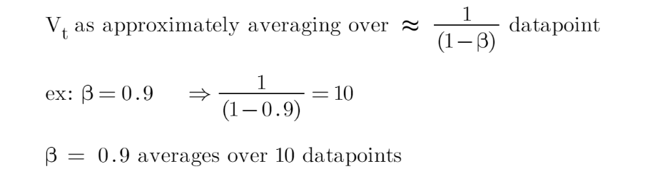
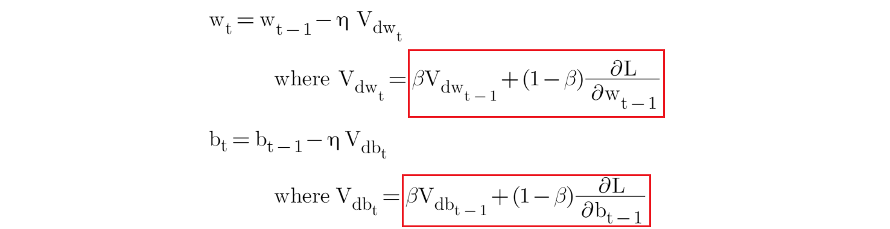
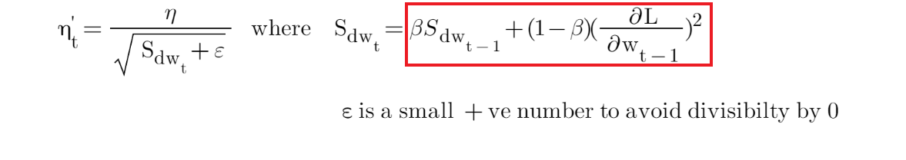
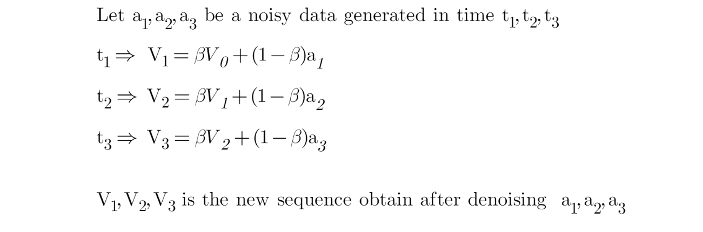
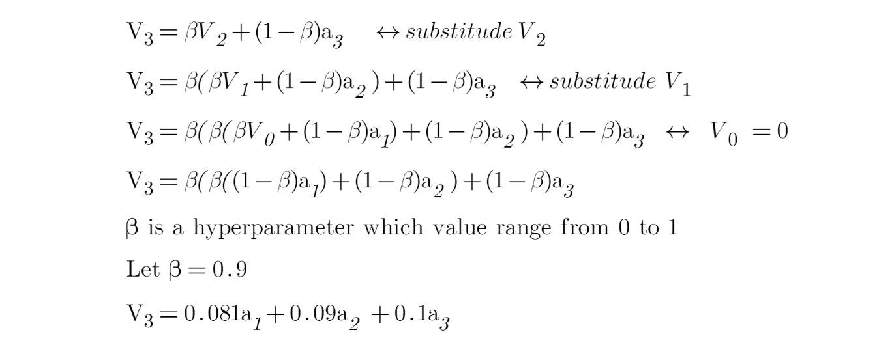

```{r setup, include=FALSE}
knitr::opts_chunk$set(echo = TRUE)
```

I have been reading about lost functions and optimisers in deep learning for the last couple of days when I stumble upon the term Exponentially Weighted Average (EWA). So, in this post I aims to explain my understanding of EWA. 

## Overview of EWA   

EWA basically  is an important concept in deep learning and have been used in several optimisers to smoothen the noise of the data.

Let's see the formula for EWA:

```{r, echo=FALSE, out.width='60%', fig.align='center'}

```

*V~t~* is some smoothen value at point *t*, while *S~t~* is a data point at point *t*. *B* here is a hyperparameter that we need to tune in our network. So, the choice of *B* will determine how many data points that we average the value of *V~t~* as shown below:

```{r, echo=FALSE, out.width='80%', fig.align='center'}

```

## EWA in deep learnings' optimiser

So, some of the optimisers that adopt the approach of EWA are (red box indicates the EWA part in each formula):

1) Stochastic gradient descent (SGD) with momentum

The issue with SGD is the present of noise while searching for global minima. So, SGD with momentum integrated the EWA, which reduces these noises and helps the network converges faster.

```{r, echo=FALSE, out.width='80%', fig.align='center'}

```

2) Adaptive delta (Adadelta) and Root Mean Square Propagation (RMSprop)

Adadelta and RMSprop are proposed in attempt to solve the issue of diminishing learning rate of adaptive gradient (Adagrad) optimiser. The use of EWA in both optimisers actually helps to achieve this. Both optimisers have quite a similar formula, but attached below is the formula for Adadelta.

```{r, echo=FALSE, out.width='80%', fig.align='center'}

```

3) Adaptive moment estimation (ADAM)   

ADAM basically combined the SGD with momentum with Adadelta. As shown earlier, both optimisers use EWA.

## More details on EWA

Now, let's go back to EWA. Here is the example of calculation of EWA:

```{r, echo=FALSE, out.width='90%', fig.align='center'}

```

Keep in mind that *t~3~* is the latest time point, followed by *t~2~* and *t~1~*, respectively. So, if we want to calculate *V~3~*:

```{r, echo=FALSE, out.width='90%', fig.align='center'}

```

So, if we were to varies the value of *B* across the equation (while the values of *a~1~...a~n~* remain constant), we can do so in R.

```{r, message=FALSE}
library(tidyverse) 

func <- function(b) (1 - b) * b^((20:1) - 1)
beta <- seq(0.1, 0.9, by=0.2)

dat <- t(sapply(beta, func)) %>% 
  as.data.frame()
colnames(dat)[1:20] <- 1:20

dat %>%  
  mutate(beta = as_factor(beta)) %>%
  pivot_longer(cols = 1:20, names_to = "data_point", values_to = "weight") %>% 
  ggplot(aes(x=as.numeric(data_point), y=weight, color=beta)) +
  geom_line() +
  geom_point() +
  scale_x_continuous(breaks = 1:20) +
  labs(title = "Change of Exponentially Weighted Average function", 
       subtitle = "Time at t20 is the recent time, and t1 is the initial time") +
  scale_colour_discrete("Beta:") +
  xlab("Time(t)") +
  ylab("Weights/Coefficients") +
  theme_bw()
```

Note that time at t~20~ is the recent time, and t~1~ is the initial time. Thus, two main points from the above plot are:  

1) The EWA function acts in a decaying manner.      
2) As beta, *B* increases we actually put more emphasize on the recent data point.                  

*Side note: I have tried to do the plot in plotly, not sure why it did not work* `r emo::ji("confused")`

References:   
1) https://towardsdatascience.com/deep-learning-optimizers-436171c9e23f (all the equations are from this reference)   
2) https://youtu.be/NxTFlzBjS-4   
3) https://medium.com/@dhartidhami/exponentially-weighted-averages-5de212b5be46   
