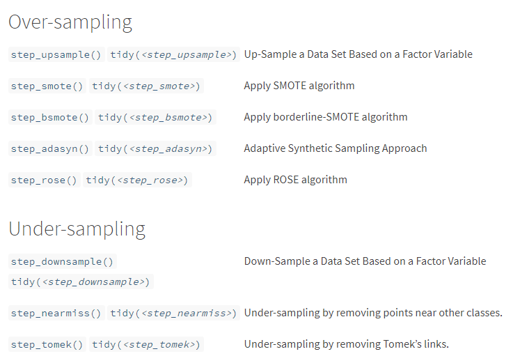

## Overview

Imbalance data happens when there is unequal distribution of data within a categorical outcome variable. Imbalance data occurs due to several reasons such as biased sampling method and measurement errors. However, the imbalance may also be the inherent characteristic of the data. For example, a rare disease predictive model, in this case, the imbalance is expected.

Generally, there are two types of imbalanced problem:   

- Slight imblance: the imbalance is small, like 4:6
- Severe imbalance: the imbalance is large, like 1:100 or more

In slight imbalanced cases, usually it is not a concern, while severe imbalanced cases require a more specialised method to to build a predictive model.

## The problem

What's the problem with the imbalanced data?     
Firstly, a predictive model of an imbalanced is bias towards the majority class. The minority class becomes harder to predict as there a few data from this class. So, the detection rate for a minority class will be very low.
Secondly, accuracy is not a good measure in this case. We may get a good accuracy,but in reality the accuracy does not reflect the unequal distribution of the data. This is known as an [accuracy paradox](https://en.wikipedia.org/wiki/Accuracy_paradox). Imagine we have 90% of data belong to the majority class, while the remaining 10% belong to the minority class. So, just by predicting all data as a majority class, the model can easily get 90% accuracy.

## Handling approach

The easiest approach is to collect more data, though this may not be practical in all situation. Fortunately, there are a few machine learning techniques available to tackle this problem.

Here is a summary of resampling techniques available in `themis` package.

```{r, echo=FALSE, out.width='90%', fig.align='center'}

```
Over-sampling approach is preferred when the dataset is small. The under-sampling approach can be used when the dataset is large, though this approach may lead to loss of information. Additionally, ensemble technique such as random forest is said to be able to model the imbalanced data, though some references/blogs say otherwise.

So, we are going to compare four of over-sampling techniques (upsample, SMOTE, ADASYN, and ROSE), and three of under-sampling techniques (downsample, nearmiss and tomek). The base model is a decision tree, which will be used for all the techniques. The decision trees are not going to be extensively hyperparameter tuned, for the sake of simplicity. Additionally, random forest is also going to be included in the comparison.

The dataset is from [here](https://raw.githubusercontent.com/finnstats/finnstats/main/binary.csv). This is a summary of the dataset.

```{r packages, message=FALSE, warning=FALSE, echo=FALSE}
# Packages
library(tidyverse)
library(magrittr)
library(tidymodels)
library(themis)

# Data
df <- read.csv("https://raw.githubusercontent.com/finnstats/finnstats/main/binary.csv")
df %<>% mutate_at(c("admit", "rank"), as_factor)
```

```{r summary}
skimr::skim(df)
```

As we can see from the summary, variable admit has a moderate imbalanced data about 3:7 ratio.
```{r barplot}
ggplot(df, aes(admit)) + 
  geom_bar() +
  theme_bw()
```

Below is the code for each model.

<details>
  <summary>Toggle answer</summary>
```{r code_model, warning=FALSE, message=FALSE}
# Packages
library(tidyverse)
library(magrittr)
library(tidymodels)
library(themis)

# Data
df <- read.csv("https://raw.githubusercontent.com/finnstats/finnstats/main/binary.csv")

# Split data
set.seed(1234)
df_split <- initial_split(df)
df_train <- training(df_split)
df_test <- testing(df_split)

# 1) Decision tree ----

# Recipe
dt_rec <- 
  recipe(admit ~., data = df_train) %>% 
  step_mutate_at(c("admit", "rank"), fn = as_factor) %>% 
  step_dummy(rank)

df_train_rec <- 
  dt_rec %>% 
  prep() %>% 
  bake(new_data = NULL)
  
df_test_rec <- 
  dt_rec %>% 
  prep() %>% 
  bake(new_data = df_test)

## 10-folds CV
set.seed(1234)
df_cv <- vfold_cv(df_train_rec)

# Tune and finalize workflow
## Specify model
dt_mod <- 
  decision_tree(
    cost_complexity = tune(),
    tree_depth = tune(),
    min_n = tune()
  ) %>% 
  set_engine("rpart") %>% 
  set_mode("classification")

## Specify workflow
dt_wf <- 
  workflow() %>% 
  add_model(dt_mod) %>% 
  add_formula(admit ~.)

## Tune model
set.seed(1234)
dt_tune <- 
  dt_wf %>% 
  tune_grid(resamples = df_cv,
            metrics = metric_set(accuracy))

## Select best model
best_tune <- dt_tune %>% select_best("accuracy")

## Finalize workflow
dt_wf_final <- 
  dt_wf %>% 
  finalize_workflow(best_tune)

# Fit on train data
dt_train <- 
  dt_wf_final %>% 
  fit(data = df_train_rec)

# Fit on test data and get accuracy
df_test  %<>%  
  bind_cols(predict(dt_train, new_data = df_test_rec)) %>% 
  rename(pred = .pred_class)

# 2) Oversampling ----
## step_upsample() ----

# Recipe
up_rec <- 
  recipe(admit ~., data = df_train) %>% 
  step_mutate_at(c("admit", "rank"), fn = as_factor) %>% 
  step_dummy(rank) %>% 
  step_upsample(admit,
                seed = 1234)

df_train_up <- 
  up_rec %>% 
  prep() %>% 
  bake(new_data = NULL)

df_test_rec_up <- 
  up_rec %>% 
  prep() %>% 
  bake(new_data = df_test)

## 10-folds CV
set.seed(1234)
df_cv_up <- vfold_cv(df_train_up)

# Tune and finalize workflow
## Specify model
# same as before

## Specify workflow
dt_wf_up <- 
  workflow() %>% 
  add_model(dt_mod) %>% 
  add_formula(admit ~.)

## Tune model
set.seed(1234)
dt_tune_up <- 
  dt_wf_up %>% 
  tune_grid(resamples = df_cv_up,
            metrics = metric_set(accuracy))

## Select best model
best_tune_up <- dt_tune_up %>% select_best("accuracy")

## Finalize workflow
dt_wf_final_up <- 
  dt_wf_up %>% 
  finalize_workflow(best_tune_up)

# Fit on train data
dt_train_up <- 
  dt_wf_final_up %>% 
  fit(data = df_train_up)

# Fit on test data and get accuracy
df_test  %<>%  
  bind_cols(predict(dt_train_up, new_data = df_test_rec_up)) %>% 
  rename(pred_up = .pred_class)

## step_smote() ----

# Recipe
smote_rec <- 
  recipe(admit ~., data = df_train) %>% 
  step_mutate_at(c("admit", "rank"), fn = as_factor) %>% 
  step_dummy(rank) %>% 
  step_smote(admit, 
             seed = 1234)

df_train_smote <- 
  smote_rec %>% 
  prep() %>% 
  bake(new_data = NULL)

df_test_rec_smote <- 
  smote_rec %>% 
  prep() %>% 
  bake(new_data = df_test)

## 10-folds CV
set.seed(1234)
df_cv_smote <- vfold_cv(df_train_smote)

# Tune and finalize workflow
## Specify model
# same as before

## Specify workflow
dt_wf_smote <- 
  workflow() %>% 
  add_model(dt_mod) %>% 
  add_formula(admit ~.)

## Tune model
set.seed(1234)
dt_tune_smote <- 
  dt_wf_smote %>% 
  tune_grid(resamples = df_cv_smote,
            metrics = metric_set(accuracy))

## Select best model
best_tune_smote <- dt_tune_smote %>% select_best("accuracy")

## Finalize workflow
dt_wf_final_smote <- 
  dt_wf_smote %>% 
  finalize_workflow(best_tune_smote)

# Fit on train data
dt_train_smote <- 
  dt_wf_final_smote %>% 
  fit(data = df_train_smote)

# Fit on test data and get accuracy
df_test  %<>%  
  bind_cols(predict(dt_train_smote, new_data = df_test_rec_smote)) %>% 
  rename(pred_smote = .pred_class)

## step_rose() ----

# Recipe
rose_rec <- 
  recipe(admit ~., data = df_train) %>% 
  step_mutate_at(c("admit", "rank"), fn = as_factor) %>% 
  step_dummy(rank) %>% 
  step_rose(admit, 
             seed = 1234)

df_train_rose <- 
  rose_rec %>% 
  prep() %>% 
  bake(new_data = NULL)

df_test_rec_rose <- 
  rose_rec %>% 
  prep() %>% 
  bake(new_data = df_test)

## 10-folds CV
set.seed(1234)
df_cv_rose <- vfold_cv(df_train_rose)

# Tune and finalize workflow
## Specify model
# same as before

## Specify workflow
dt_wf_rose <- 
  workflow() %>% 
  add_model(dt_mod) %>% 
  add_formula(admit ~.)

## Tune model
set.seed(1234)
dt_tune_rose <- 
  dt_wf_rose %>% 
  tune_grid(resamples = df_cv_rose,
            metrics = metric_set(accuracy))

## Select best model
best_tune_rose <- dt_tune_rose %>% select_best("accuracy")

## Finalize workflow
dt_wf_final_rose <- 
  dt_wf_rose %>% 
  finalize_workflow(best_tune_rose)

# Fit on train data
dt_train_rose <- 
  dt_wf_final_rose %>% 
  fit(data = df_train_rose)

# Fit on test data and get accuracy
df_test  %<>%  
  bind_cols(predict(dt_train_rose, new_data = df_test_rec_rose)) %>% 
  rename(pred_rose = .pred_class)

## step_adasyn() ----

# Recipe
adasyn_rec <- 
  recipe(admit ~., data = df_train) %>% 
  step_mutate_at(c("admit", "rank"), fn = as_factor) %>% 
  step_dummy(rank) %>% 
  step_adasyn(admit, 
            seed = 1234)

df_train_adasyn <- 
  adasyn_rec %>% 
  prep() %>% 
  bake(new_data = NULL)

df_test_rec_adasyn <- 
  adasyn_rec %>% 
  prep() %>% 
  bake(new_data = df_test)

## 10-folds CV
set.seed(1234)
df_cv_adasyn <- vfold_cv(df_train_adasyn)

# Tune and finalize workflow
## Specify model
# same as before

## Specify workflow
dt_wf_adasyn <- 
  workflow() %>% 
  add_model(dt_mod) %>% 
  add_formula(admit ~.)

## Tune model
set.seed(1234)
dt_tune_adasyn <- 
  dt_wf_adasyn %>% 
  tune_grid(resamples = df_cv_adasyn,
            metrics = metric_set(accuracy))

## Select best model
best_tune_adasyn <- dt_tune_adasyn %>% select_best("accuracy")

## Finalize workflow
dt_wf_final_adasyn <- 
  dt_wf_adasyn %>% 
  finalize_workflow(best_tune_adasyn)

# Fit on train data
dt_train_adasyn <- 
  dt_wf_final_adasyn %>% 
  fit(data = df_train_adasyn)

# Fit on test data and get accuracy
df_test  %<>%  
  bind_cols(predict(dt_train_adasyn, new_data = df_test_rec_adasyn)) %>% 
  rename(pred_adasyn = .pred_class)

# 3) Undersampling ----
## step_downsample() ----

# Recipe
down_rec <- 
  recipe(admit ~., data = df_train) %>% 
  step_mutate_at(c("admit", "rank"), fn = as_factor) %>% 
  step_dummy(rank) %>% 
  step_downsample(admit,
                seed = 1234)

df_train_down <- 
  down_rec %>% 
  prep() %>% 
  bake(new_data = NULL)

df_test_rec_down <- 
  down_rec %>% 
  prep() %>% 
  bake(new_data = df_test)

## 10-folds CV
set.seed(1234)
df_cv_down <- vfold_cv(df_train_down)

# Tune and finalize workflow
## Specify model
# same as before

## Specify workflow
dt_wf_down <- 
  workflow() %>% 
  add_model(dt_mod) %>% 
  add_formula(admit ~.)

## Tune model
set.seed(1234)
dt_tune_down <- 
  dt_wf_down %>% 
  tune_grid(resamples = df_cv_down,
            metrics = metric_set(accuracy))

## Select best model
best_tune_down <- dt_tune_down %>% select_best("accuracy")

## Finalize workflow
dt_wf_final_down <- 
  dt_wf_down %>% 
  finalize_workflow(best_tune_down)

# Fit on train data
dt_train_down <- 
  dt_wf_final_down %>% 
  fit(data = df_train_down)

# Fit on test data and get accuracy
df_test  %<>%  
  bind_cols(predict(dt_train_down, new_data = df_test_rec_down)) %>% 
  rename(pred_down = .pred_class)

## step_nearmiss() ----

# Recipe
nearmiss_rec <- 
  recipe(admit ~., data = df_train) %>% 
  step_mutate_at(c("admit", "rank"), fn = as_factor) %>% 
  step_dummy(rank) %>% 
  step_nearmiss(admit,
                  seed = 1234)

df_train_nearmiss <- 
  nearmiss_rec %>% 
  prep() %>% 
  bake(new_data = NULL)

df_test_rec_nearmiss <- 
  nearmiss_rec %>% 
  prep() %>% 
  bake(new_data = df_test)

## 10-folds CV
set.seed(1234)
df_cv_nearmiss <- vfold_cv(df_train_nearmiss)

# Tune and finalize workflow
## Specify model
# same as before

## Specify workflow
dt_wf_nearmiss <- 
  workflow() %>% 
  add_model(dt_mod) %>% 
  add_formula(admit ~.)

## Tune model
set.seed(1234)
dt_tune_nearmiss <- 
  dt_wf_nearmiss %>% 
  tune_grid(resamples = df_cv_nearmiss,
            metrics = metric_set(accuracy))

## Select best model
best_tune_nearmiss <- dt_tune_nearmiss %>% select_best("accuracy")

## Finalize workflow
dt_wf_final_nearmiss <- 
  dt_wf_nearmiss %>% 
  finalize_workflow(best_tune_nearmiss)

# Fit on train data
dt_train_nearmiss <- 
  dt_wf_final_nearmiss %>% 
  fit(data = df_train_nearmiss)

# Fit on test data and get accuracy
df_test  %<>%  
  bind_cols(predict(dt_train_nearmiss, new_data = df_test_rec_nearmiss)) %>% 
  rename(pred_nearmiss = .pred_class)

## step_tomek() ----

# Recipe
tomek_rec <- 
  recipe(admit ~., data = df_train) %>% 
  step_mutate_at(c("admit", "rank"), fn = as_factor) %>% 
  step_dummy(rank) %>% 
  step_tomek(admit,
                  seed = 1234)

df_train_tomek <- 
  tomek_rec %>% 
  prep() %>% 
  bake(new_data = NULL)

df_test_rec_tomek <- 
  tomek_rec %>% 
  prep() %>% 
  bake(new_data = df_test)

## 10-folds CV
set.seed(1234)
df_cv_tomek <- vfold_cv(df_train_tomek)

# Tune and finalize workflow
## Specify model
# same as before

## Specify workflow
dt_wf_tomek <- 
  workflow() %>% 
  add_model(dt_mod) %>% 
  add_formula(admit ~.)

## Tune model
set.seed(1234)
dt_tune_tomek <- 
  dt_wf_tomek %>% 
  tune_grid(resamples = df_cv_tomek,
            metrics = metric_set(accuracy))

## Select best model
best_tune_tomek <- dt_tune_tomek %>% select_best("accuracy")

## Finalize workflow
dt_wf_final_tomek <- 
  dt_wf_tomek %>% 
  finalize_workflow(best_tune_tomek)

# Fit on train data
dt_train_tomek <- 
  dt_wf_final_tomek %>% 
  fit(data = df_train_tomek)

# Fit on test data and get accuracy
df_test  %<>%  
  bind_cols(predict(dt_train_tomek, new_data = df_test_rec_tomek)) %>% 
  rename(pred_tomek = .pred_class)

# 4) Ensemble approach: random forest ----

## 10-folds CV
set.seed(1234)
df_cv <- vfold_cv(df_train_rec)

# Tune and finalize workflow
## Specify model
rf_mod <- rand_forest(
 mtry = tune(),
 trees = tune(),
 min_n = tune()
 ) %>% 
  set_engine("ranger") %>% 
  set_mode("classification")

## Specify workflow
rf_wf <- 
  workflow() %>% 
  add_model(rf_mod) %>% 
  add_formula(admit ~.)

## Tune model
set.seed(1234)
rf_tune <- 
  rf_wf %>% 
  tune_grid(resamples = df_cv,
            metrics = metric_set(accuracy))

## Select best model
best_tune <- rf_tune %>% select_best("accuracy")

## Finalize workflow
rf_wf_final <- 
  rf_wf %>% 
  finalize_workflow(best_tune)

# Fit on train data
rf_train <- 
  rf_wf_final %>% 
  fit(data = df_train_rec)

# Fit on test data and get accuracy
df_test  %<>%  
  bind_cols(predict(rf_train, new_data = df_test_rec)) %>% 
  rename(pred_rf = .pred_class)

```
</details>

Now, let's get the accuracy, sensitivity, specificity, and [Mathews Correlation Coefficient (MCC)](https://en.wikipedia.org/wiki/Matthews_correlation_coefficient#Advantages_of_MCC_over_accuracy_and_F1_score) for each model.

```{r summary-measure, warning=FALSE}
# Get all measurements
df_test$admit %<>% as_factor()
pred_col <- colnames(df_test)[5:13]
result <- vector("list", 0)
sensi <- vector("list", 0)
specif <- vector("list", 0)
mathew <- vector("list", 0)

for (i in seq_along(pred_col)) {
  # accuracy
  result[[i]] <-
    df_test %>% 
    accuracy(admit, df_test[,pred_col[i]])
  
  # sensitivity
  sensi[[i]] <-
    df_test %>% 
    sensitivity(admit, df_test[,pred_col[i]])
  
  # specificity
  specif[[i]] <-
    df_test %>% 
    specificity(admit, df_test[,pred_col[i]])
  
  # MCC
  mathew[[i]] <-
    df_test %>% 
    mcc(admit, df_test[,pred_col[i]])
}

## Turn into dataframe
result  %<>%  
  enframe() %>% 
  unnest(cols = c("value")) %>% 
  rename(model = name, 
         accuracy = .estimate) %>% 
  select(model, accuracy) %>% 
  mutate(model = factor(model,labels = 
                          c(
                            "1" = "base",
                            "2" = "upsample",
                            "3" = "smote",
                            "4" = "rose",
                            "5" = "adasyn",
                            "6" = "downsample",
                            "7" = "nearmiss",
                            "8" = "tomek",
                            "9" = "random_forest"
                            )
                        ))

sensi  %<>%  
  enframe() %>% 
  unnest(cols = c("value"))

specif %<>% 
  enframe() %>% 
  unnest(cols = c("value"))

mathew %<>% 
  enframe() %>% 
  unnest(cols = c("value"))

result %<>% 
  bind_cols(sensitive = sensi$.estimate, specific = specif$.estimate, mathew = mathew$.estimate)

# Plot the result
result %>% 
  pivot_longer(cols = 2:5, names_to = "measure") %>% 
  ggplot(aes(x = model, y = value, fill = measure)) +
  geom_bar(position = "dodge", stat = "identity") +
  theme_bw() +
  coord_flip() +
  geom_text(aes(label = paste0(round(value*100, digits = 1), "%")), 
            position = position_dodge(0.9), vjust = 0.3, size = 4, hjust = -0.1) +
  labs(title = "Comparison of unbalanced data techniques", 
       x = "Techniques", 
       y = "Performance") +
  scale_fill_discrete(name = "Metrics:",
                      labels = c("Accuracy", "MCC", "Sensitivity", "Specificity"))
  
```

We can see from the above plot, the base model (decision tree) clearly has low detection rate for a minority class (specificity). All methods able to increase the specificity, while sacrificing the accuracy and sensitivity. As mentioned earlier, accuracy is not a good metrics for this kind of model (ie; accuracy paradox). MCC on the other hand, takes into account all values of confusion matrix; true positive, false positive, true negative, and false negative. Hence, MCC is more informative compared to accuracy (and F score, which has not been included in the plot, for the sake of simplicity).  

A more balanced model probably ADASYN or tomek approaches based on MCC, specificity, and sensitivity.


References:  

1. https://themis.tidymodels.org/reference/index.html  
2. https://machinelearningmastery.com/tactics-to-combat-imbalanced-classes-in-your-machine-learning-dataset/   
3. https://bmcgenomics.biomedcentral.com/articles/10.1186/s12864-019-6413-7
