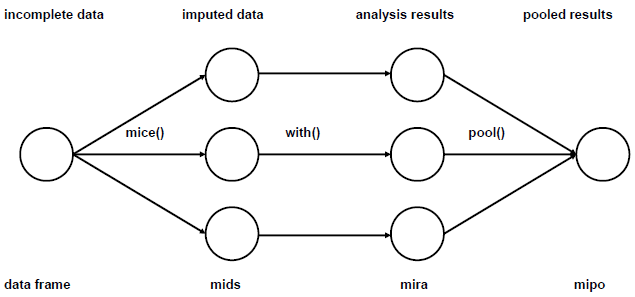

```{r setup, include=FALSE}
knitr::opts_chunk$set(echo = TRUE, warning = F, message = F)
```

## Background

Missing data is quite challenging to deal with. Deleting it may be the easiest solution, but may not be the best solution. Missing data can be categorised into 3 types ([Rubin, 1976](https://www.jstor.org/stable/2335739)):

1)  MCAR

    -   Missing Completely At Random
    -   Example; some of the observations are missing due to lost of records during the flood

2)  MAR

    -   Missing At Random
    -   Example; variable income are missing as some participant refuse to give their salary information which they deems as very personal information

3)  MNAR

    -   Missing Not At Random
    -   Example; weight variable is missing for morbidly obese participants since the scale is unable to weight them

Out of the 3 types above, the most problematic is MNAR, though there exist methods to deal with this type. For example, the [miceMNAR](https://cran.r-project.org/web/packages/miceMNAR/miceMNAR.pdf) package in R.

There are several approaches in handling missing data:

1)  Listwise-deletion

    -   Best approach if the amount of missingness is very small

2)  Simple imputation

    -   Using mean/median/mode imputation
    -   This approach is not advisable as it leads to bias due to reduce variance, though the mean is not affected

3)  Single imputation

    -   Simple imputation above is considered as single imputation as well
    -   This approach ignores uncertainty of the imputation and almost always underestimate the variance

4)  Multiple imputation

    -   A bit advanced and it cover the limitation of single imputation approach

However, the main assumption for any imputation methods is the missingness should be MCAR or MAR.

## Multiple imputation

In short, there are 2 approaches of multiple imputation implemented by packages in R:

1.  Joint modeling (JM) or joint multivariate normal distribution multiple imputation

    -   The main assumption for this method is that the observed data follows a multivariate normal distribution
    -   A violation of this assumption produces incorrect values, though a slight violation is still okay
    -   Some packages that implemented this method: `Amelia` and `norm`

2.  Fully conditional specification (FCS) or conditional multiple imputation

    -   Also known as multivariate imputation by chained equation (MICE)
    -   This approach is a bit flexible as distribution is assumed for each variable rather than the whole dataset
    -   Some package that implemented this method: `mice` and `mi`

## Example

In `mice` package, the general steps are:

1.  `mice()` - impute the NAs.
2.  `with()` - run the analysis (lm, glm, etc).
3.  `pool()` - pool the results.

```{r, fig.align='center', fig.cap="Main steps in mice package.", echo=FALSE, out.width="90%", out.height="90%"}

```

These are the required packages.

```{r}
library(tidyverse)
library(mice)
library(VIM)
#library(missForest) we want to use prodNA() function from this package
library(naniar)
library(niceFunction) #install from github (https://github.com/tengku-hanis/niceFunction)
library(dplyr)
library(gtsummary)
```

We going to produce some NAs randomly.

```{r}
set.seed(123)
dat <- iris %>% 
  select(-Sepal.Length)%>% 
  missForest::prodNA(0.2) %>%  # randomly insert 20% NAs
  mutate(Sepal.Length = iris$Sepal.Length)
```

Explore the NAs and the data.

```{r}
naniar::miss_var_summary(dat)
```

Some references recommend to remove variables with more than 50% NAs. However, we purposely introduce 20% NAs into our data.

As a guideline, we can check for MCAR for our NAs.

```{r}
naniar::mcar_test(dat) #p > 0.05, MCAR is indicated
```

Next step is to evaluate the pattern of missingness in our data.

```{r}
md.pattern(dat, rotate.names = T, plot = T) 
```

```{r}
aggr(dat, prop = F, numbers = T) 
```

We have 13 patterns (numbers on the right) of NAs in our data. These 2 functions work well with small dataset, but with a larger dataset (and with lot more pattern of NAs), it's probably quite difficult to assess the pattern.

`matrixplot()` probably more appropriate for a larger dataset.

```{r}
matrixplot(dat)
```

In terms of the missingness pattern, we can also assess the distribution of NAs of Sepal.Width is dependent on the variable Sepal.Length.

```{r}
niceFunction::histNA_byVar(dat, Sepal.Width, Sepal.Length)
```

As we can see the distribution and range of the histograms of the NAs (True) and non-NAs (False) is quite similar. Thus, this may indicated that Sepal.Width is at least MAR. However, by right we should do this for each pair of numerical variable before jumping into any conclusion.

Another good thing to assess is the correlation.

```{r}
# Data with 1 = NAs, 0 = non-NAs
x <- as.data.frame(abs(is.na(dat))) %>% 
  dplyr::select(-Sepal.Length) #pick variable with NAs only
```

Firstly, the correlation between the variables with missing data.

```{r}
cor(x) %>% 
  corrplot::corrplot()
```

No high correlation among variable with NAs. Secondly, let's see correlation between NAs in a variable and the observed values of other variables.

```{r}
cor(dat %>% mutate(Species = as.numeric(Species)), x, use = "pairwise.complete.obs")
```

Again, there is no high correlation. But, if we were to interpret this correlation matrix; the rows are the observed variables and the columns represent the missingness. For example, missing values of Sepal.Width is more likely to be missing for observations with a high value of Petal.Width (r = 0.05 indicates it's highly unlikely though).

Now, we can do multiple imputation. These are the methods in the `mice` package:

```{r}
methods(mice)
```

By default, mice uses:

-   pmm (predictive mean matching) for numeric data
-   logreg (logistic regression imputation) for binary data, factor with 2 levels
-   polyreg (polytomous regression imputation) for unordered categorical data (factor > 2 levels)
-   polr (proportional odds model) for ordered, > 2 levels

let's run the mice function to our data:

```{r}
imp <- mice(dat, m = 5, seed=1234, maxit = 5, printFlag = F) 
imp
```

Next, we can do some diagnostic assessment on the imputed data. This is our imputed data.

```{r}
imp$imp$Sepal.Width %>% head()
```

One important thing to check is the convergence. We are going increase the number of iteration for this.

```{r}
imp_conv <- mice.mids(imp, maxit = 30, printFlag = F)
plot(imp_conv)
```

The line in the plot should be intermingled and no obvious trend should be observed. Our plot above indicates a convergence.

We can also assess density plot of imputed data and the observed data. Blue color is the observed data and red color is the imputed data.

```{r}
densityplot(imp)
```

We can further assess variable Sepal.Width.

```{r}
densityplot(imp, ~ Sepal.Width | .imp)
```

Lastly, we can assess the strip plot. The imputed observations (red color) should not distributed too far from the observed data (blue color).

```{r}
stripplot(imp)
```

So, once we finish the diagnostic checking, we can actually go back and change the imputation method for Sepal.Width, since the its distribution changes quite differently at each iteration. But, we are not going to do that, instead we are going to do the analysis.

```{r}
# run regression
fit <- with(imp, lm(Sepal.Length ~ Sepal.Width + Petal.Length + Petal.Width + Species))
# pool all imputed set
pooled <- pool(fit) 
summary(pooled)
```

Since we have the original dataset without the NAs, we going to compare them.

```{r}
mimpute <- 
  fit %>% 
  tbl_regression() #with mice

noimpute <- 
  dat %>% 
  lm(Sepal.Length ~ ., data = .) %>% 
  tbl_regression() #w/o mice

original <- 
  iris %>% 
  lm(Sepal.Length ~ ., data = .) %>% 
  tbl_regression() #original data

tbl_merge(
  tbls = list(mimpute, noimpute, original), 
  tab_spanner = c("With MICE", "Without MICE", "Original data")
)
```

There is a different in the result between the original dataset (no NAs) and with mice imputation. Probably, exploring other imputation methods will produce a better result.

There are a lot more that are not cover in this post. For example [passive imputation and post-processing](https://www.gerkovink.com/miceVignettes/Passive_Post_processing/Passive_imputation_post_processing.html). In fact, there are a series of [vignettes](https://github.com/amices/mice#vignettes) written by Gerko Vink and Stef van Buuren (both are the authors of `mice`) which provides a good tutorial on using `mice` though quite advanced.

Suggested online books (though, I have not really studied both of the books yet):

1.  [Flexible imputation of missing data](https://stefvanbuuren.name/fimd/) by Stef van Buuren
2.  [Applied missing data analysis with SPSS and (R)Studio](https://bookdown.org/mwheymans/bookmi/)

References for this post:

1.  [R in Action, Data analysis and graphics with R](http://www.cs.uni.edu/~jacobson/4772/week11/R_in_Action.pdf) (Chapter 15)
2.  <https://data.library.virginia.edu/getting-started-with-multiple-imputation-in-r/>
3.  <https://stats.idre.ucla.edu/r/faq/how-do-i-perform-multiple-imputation-using-predictive-mean-matching-in-r/>
4. [mice: Multivariate Imputation by Chained Equations in R](https://www.jstatsoft.org/article/view/v045i03)
