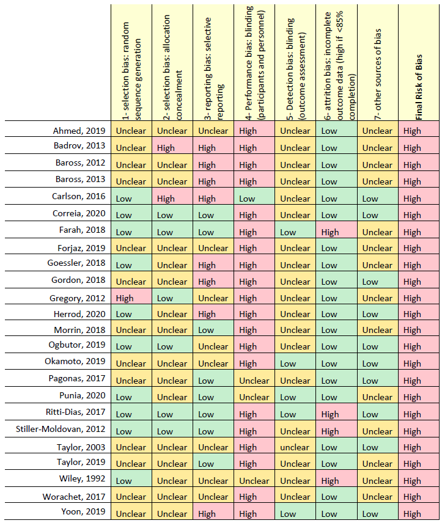

```{r setup, include=FALSE}
knitr::opts_chunk$set(echo = TRUE, message = F, warning = F)
```

In a couple of days, I am going to conduct a pre-conference workshop for Malaysian [R conference 2021](https://www.r-conference.com/). So, some of the data that I am going to use for this workshop is available in a table in pdf form. Hence, this post is about how I get that particular table from the pdf into R for further analysis.

So, this is a table we going to extract.



## Extracting a table from pdf

We going to use `tabulizer` package for this. However, not every pdf works with this package. In our case, it works but need further preprocessing.

Load the required packages.

```{r}
library(tabulizer)
library(dplyr)
library(stringr)
```

Read a table from a pdf.

```{r}
raw_table <- extract_tables("https://static-content.springer.com/esm/art%3A10.1038%2Fs41440-021-00720-3/MediaObjects/41440_2021_720_MOESM1_ESM.pdf", 
                          pages = 17, 
                          output = "data.frame")
```

So, this is the extracted table.

```{r}
raw_table[[1]] %>% head(10)
```

So, a few preprocessing steps needed:

1.  Remove column X.9 - this column supposed to be a header
2.  Rename a header based on column X.9
3.  Remove a space between the author name - "Ahmed,2019" instead of "Ahmed, 2019"
4.  Remove empty rows

```{r}
irt_rob <- 
  raw_table[[1]] %>% 
  select(-X.9) %>%  
  rename(Study = X, 
         Random.sequence.generation. = X.1, 
         Allocation.concealment. = X.2,
         Selective.reporting. = X.3,
         Blinding.of.participants.and.personnel. = X.4, 
         Blinding.of.outcome.assessment = X.5, 
         Incomplete.outcome.data = X.6, 
         Other.sources.of.bias. = X.7, 
         Overall = X.8) %>% 
  as_tibble() %>% 
  mutate(Study = str_replace_all(Study, " ", "")) %>% 
  mutate(id_del = str_match(Study, ".")) %>% 
  filter(!is.na(id_del)) %>% 
  select(-id_del)
```

Finally, our data is ready.

```{r, eval=FALSE}
irt_rob
```
```{r, echo=FALSE}
irt_rob %>% as.data.frame() %>% head(5)
```

