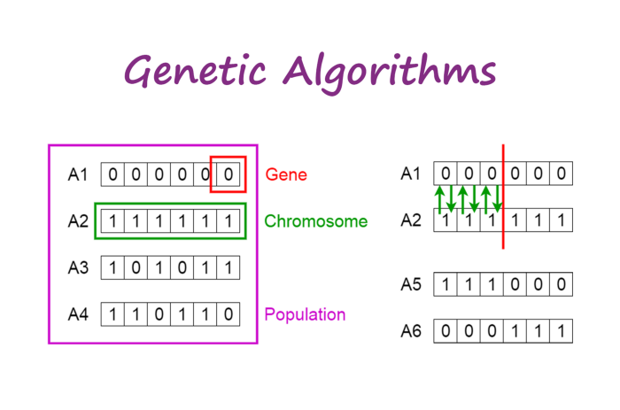

```{r setup, include=FALSE}
knitr::opts_chunk$set(echo = TRUE)
```

## Background

Genetic algorithm is inspired by a natural selection process by which the fittest individuals be selected to reproduce. This algorithm has been used in optimization and search problem, and also, can be used for variable selection.



First, let's go into a few terms related to genetic algorithm theory.

1.  Population - a set of chromosomes\
2.  Chromosome - a subset of variables (also known as individual by some reference)\
3.  Gene - a variable or feature\
4.  Fitness function - give fitness score to each chromosome and guide the selection\
5.  Selection - a process to select the two chromosome known as parents\
6.  Crossover - a process to generate offspring by parents (illustrate in the picture above, on the upper right side)\
7.  Mutation - the process by which the gene in the chromosome is randomly flipped into 1 or 0

{width="250"}

So, the basic flow of genetic algorithm:

1.  Algorithm starts with an initial population, often randomly generated\
2.  Create a successive generation by selecting a portion of the initial population (the selection is guided by the fitness function) - this includes selection -> crossover -> mutation\
3.  The algorithm terminates if certain predetermined criteria are met such as:

    -   Solution satisfies the minimum criteria\
    -   Fixed number of generation reached\
    -   Successive iteration no longer produce a better result

## Example in R

There is `GA` package in R, where we can implement the genetic algorithm a bit more manually where we can specify our own fitness function. However, I think it is easier to use a genetic algorithm implemented in `caret` package for variable selection.

Load the packages.

```{r, warning=FALSE, message=FALSE}
library(caret)
library(tidyverse)
library(rsample)
library(recipes)
```

The data.

```{r}
dat <- 
  mtcars %>% 
  mutate(across(c(vs, am), as.factor),
         am = fct_recode(am, auto = "0", man = "1"))
str(dat)
```

For this, we going to use random forest (`rfGA`). Other options are bagged tree (`treebagGA`) and `caretGA`. We are able to use other method in `caret` if we use `caretGA`.

```{r, warning=FALSE}
# specify control
ga_ctrl <- gafsControl(functions = rfGA, method = "cv", number = 5)

# run random forest
set.seed(123)
rf_ga <- gafs(x = dat %>% select(-am), 
              y = dat$am,
              iters = 5,
              gafsControl = ga_ctrl)
rf_ga
```

The optimal features/variables:

```{r}
rf_ga$optVariables
```

This is the time taken for random forest approach.

```{r}
rf_ga$times
```

By default the algorithm will find a solution or a set of variable that reduce RMSE for numerical outcome, and accuracy for categorical outcome. Also, genetic algorithm tend to overfit, that's why for the implementation in `caret` we have internal and external performance. So, for the 10-fold cross-validation, 10 genetic algorithm will be run separately. All the first nine folds are used for the genetic algorithm, and the 10th for external performance evaluation.

Let's try a variable selection using linear regression model.

```{r, warning=FALSE}
# specify control
lm_ga_ctrl <- gafsControl(functions = caretGA, method = "cv", number = 5)

# run lm
set.seed(123)
lm_ga <- gafs(x = dat %>% select(-mpg), 
              y = dat$mpg,
              iters = 5,
              gafsControl = lm_ga_ctrl,
              # below is the option for `train`
              method = "lm",
              trControl = trainControl(method = "cv", allowParallel = F))
lm_ga
```

Now, let's see how to integrate this in machine learning flow using recipes from `rsample`.

First, we split the data.

```{r}
set.seed(123)
dat_split <-initial_split(dat)
dat_train <- training(dat_split)
dat_test <- testing(dat_split)
```

We specify two recipes for numerical and categorical outcome.

```{r}
# Numerical
rec_num <- 
  recipe(mpg ~., data = dat_train) %>% 
  step_center(all_numeric()) %>% 
  step_dummy(all_nominal_predictors())

# Categorical
rec_cat <- 
  recipe(am ~., data = dat_train) %>% 
  step_center(all_numeric()) %>% 
  step_dummy(all_nominal_predictors())
```

We run random forest for numerical outcome recipes.

```{r, warning=FALSE}
# specify control
rf_ga_ctrl <- gafsControl(functions = rfGA, method = "cv", number = 5)

# run random forest
set.seed(123)
rf_ga2 <- 
  gafs(rec_num,
       data = dat_train,
       iters = 5, 
       gafsControl = rf_ga_ctrl) 
rf_ga2
```

The optimal variables.

```{r}
rf_ga2$optVariables
```

Let's try run SVM for the numerical outcome recipes.

```{r, warning=FALSE}
# specify control
svm_ga_ctrl <- gafsControl(functions = caretGA, method = "cv", number = 5)

# run SVM
set.seed(123)
svm_ga <- 
  gafs(rec_cat,
       data = dat_train,
       iters = 5, 
       gafsControl = svm_ga_ctrl,
       # below is the options to `train` for caretGA
       method = "svmRadial", #SVM with Radial Basis Function Kernel
       trControl = trainControl(method = "cv", allowParallel = T))
svm_ga
```

The optimal variables.

```{r}
svm_ga$optVariables
```

## Conclusion

Although genetic algorithm seems quite good for variable selection, the main limitation I would say is the computational time. However, if we have a lot of variables or features to reduced, using the genetic algorithm despite the long computational time seems beneficial to me.

Reference:

-   <https://topepo.github.io/caret/feature-selection-using-genetic-algorithms.html#ga>\
-   <https://towardsdatascience.com/introduction-to-genetic-algorithms-including-example-code-e396e98d8bf3>\
-   <https://towardsdatascience.com/feature-selection-using-genetic-algorithms-in-r-3d9252f1aa66>
