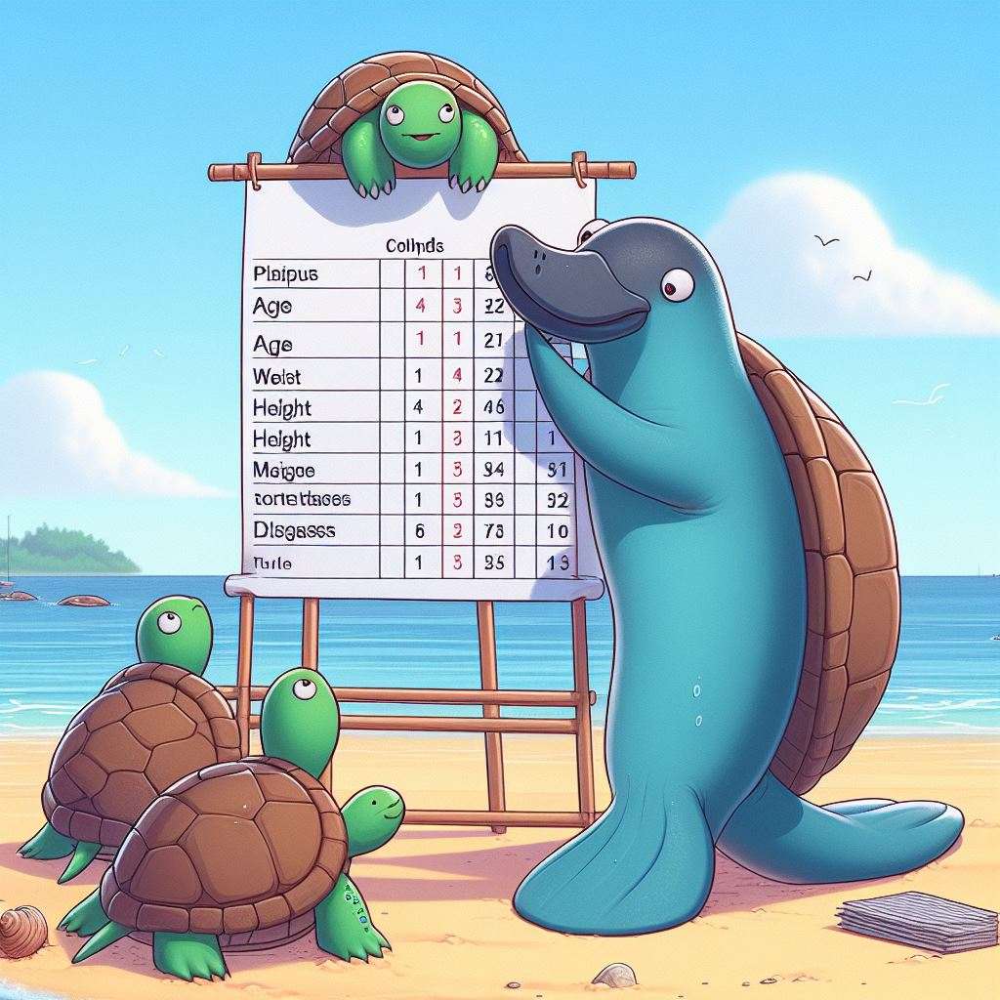

{width=60% height=40%}

A few days earlier, someone asked me to help her with the data analysis. However, the data that she gave me was so bad that it was completely impossible to run the analysis unless a serious data cleaning was done first.

So, I am thinking about what is a general guideline to consider a data is good enough to run the statistical analysis with it.

First thing first, what are the basic format of a "good enough" data.

**1. Each row represents an observation**

**2.	For a categorical variable, make sure the levels are standardised.**

For example, for gender variable, make sure to have only "male" and "female" instead of "male", "female", "men", and "women".

**3.	For a numerical variable, make sure the value is numeric and do not contain any text.**

For example, for height variable, do not  put "1.68m" or "1.68 meter".

**4.	For numerical variable as well, make sure the numeric values in the variable are in the same scale.**

For example, for weight variable, do not mix the weight in grams and kilograms. If you want to use grams, use it consistently throughout the data, or at least throughout the variable.

**5.	Do not use symbol in your data.**

For example, do not use "X" as no and "/" as yes.

**6.	The data should be an individual data.**

An individual data means that each row consists of information about each sample or observation. Each observation in the dataset represents a single entity or unit (e.g., a person, a transaction, a product) and includes all relevant attributes or variables for that unit. Individual data allow for detailed analysis at the level of individual observations. Here is an example of individual data: 

```{r echo=FALSE, warning=FALSE, message=FALSE}
library(knitr)
kable(
  read.table(header = T, text = "
  Id	Age	Obese
  1	<50	yes
  2	<50	yes
  3	>50	no
  4	>50	no
  5	>50	yes
  6	<50	yes")
  )
```

Aggregated data, on the other hand, combines multiple individual observations into summary statistics or groups. Instead of representing individual units, aggregated data presents information at a higher level of abstraction, such as groups, categories, or intervals. This aggregation typically involves summarizing data using functions like sums, averages, counts, or percentages. Here is an example of aggregated data based on the individual data previously: 

```{r echo=FALSE, warning=FALSE, message=FALSE}
library(knitr)
kable(
  read.table(header = T, text = "
  Age	Obese	Count
  <50	yes	3
  >50	no	2
  <50	no	0
  >50	yes	1")
  )
```

I think the above six points are the basics of building a good enough dataset for a statistical analysis. While we are at it, let's go through the two main formats of a dataset. These formats are more common when you have a repeated measure study design whereby each participant has several values/measurements/responds at several time points.

a.	Wide format

In the wide format, the response of each participant will be in a single row. For example, below is the data of time taking by two participants in answering three questions in second. As we can see each row consists of the time in second in answering all three questions. 

```{r echo=FALSE, warning=FALSE, message=FALSE}
library(knitr)
kable(
  read.table(header = T, text = "
ID Question1 Question2 Question3
1 5 10 50
2 8 20 40")
)
```

b.	Long format

In the long format (also known as tidy format in R community), the response at each time point of each participant will be in a single row. By using the same data previously, below is the in the long format. As we can see the data is arrange in format that each row represents each time taking to answer the question by each participant.

```{r echo=FALSE, warning=FALSE, message=FALSE}
library(knitr)
kable(
  read.table(header = T, text = "
ID Time Question
1 5 1
1 10 2
1 50 3
2 8 1
2 20 2
2 40 3")
)
```

