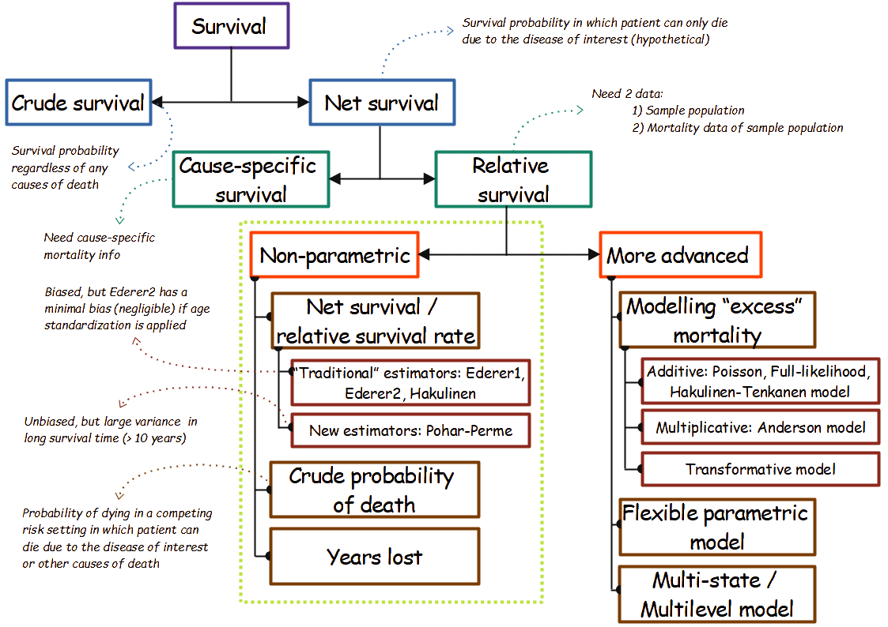
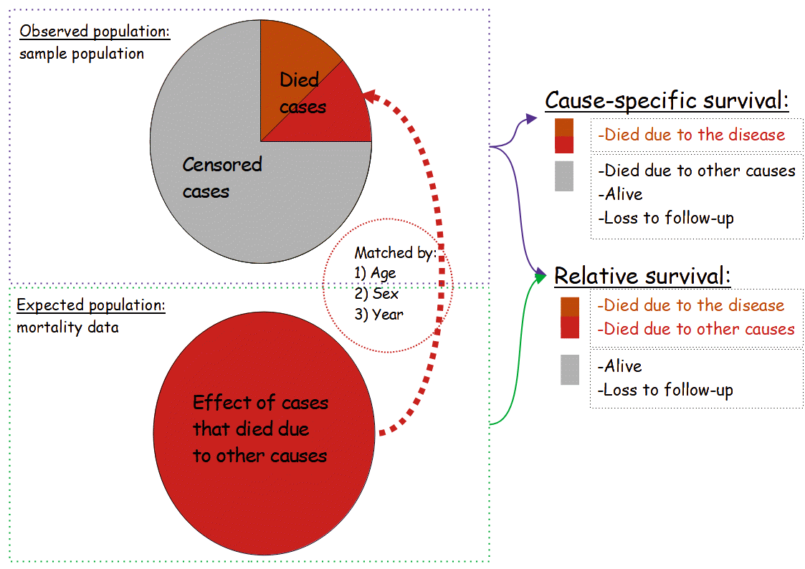

```{r setup, include=FALSE}
options(htmltools.dir.version = FALSE)
knitr::opts_chunk$set(echo = TRUE, message = FALSE, warning = FALSE, tidy = TRUE)
```

```{r xaringan-logo, echo=FALSE, eval=FALSE}
xaringanExtra::use_logo(
  image_url = "header.png", 
  width = "860px",
  height = "50px",
  position = xaringanExtra::css_position(top = "1em")
)
```

```{r xaringan-logo2, echo=FALSE}
xaringanExtra::use_logo(
  image_url = "R_MY.jpg", 
  width = "50px",
  height = "60px"
)
```

## About myself
.left-column[
```{r, echo=FALSE, out.extra='style="background-color: #5c5a54; padding:5px;"'}

```
]

.right-column[
Background: 
- PhD student in Department of Community Medicine, USM
- MSc (Medical Statistics) from USM, 2019
- MBBCh from Al-Azhar University, 2015

Interest:
- Medical statistics, population-based study
- Machine learning application in medical sciences
- Application of R (and Python) in medical data

Contact me:
- tengkuhanismokhtar@gmail.com
- Linkedin: Tengku Muhammad Hanis
- Website: https://tengkuhanis.netlify.app/
]

.footnote[
.center[
Download material:
https://github.com/tengku-hanis/relative-survival-nov2020
]
]
---
 
### Survival framework

.center[]

---

### The difference (ie. study design)

.center[]

---

## Relative survival

- General idea of relative survival (S<sub>r</sub>):

$$S_r = \frac{S_o}{S_e}$$
.center[
S<sub>o</sub> denotes overall survival in the observed population   
S<sub>e</sub> denotes overall survival in the expected population
]

- Relative survival rates (S<sub>r</sub>) is the ratio of overall survival of an observed population to the overall survival of an expected population in which there is no event of interest

- We can summarise relative survival (though mathematically incorrect!) as:     

$$\text{Relative survival} = \text{Observed survival} - \text{Expected survival}$$

---

## Why and when?

### Cause-specific survival VS relative survival   
- Choose based on **data availability**  

- **Population-based study**, should use relative survival  

- Relative survival is better for **comparison** between populations and subpopulations 

- Slight misclassification of death lead to **large bias** (in cause-specific survival)  

- The use of different population mortality data lead to a **minor change** of survival estimate (in relative survival) 

---

## Application to colrec data

1. Expanding abridged life table to a complete life table 

2. Convert expanded complete life table into a rate table
   - Use R (MortalityLaws package)
   - Use MortPak software 
   
3. Application of relative survival analysis (non-parametric):
   - Estimation of the net survival or relative survival rate 
     - Assumptions (theoretical):
         1. Independence between mortality due to the disease of interest and mortality due to other causes
         2. Comparability of the observed and expected population
     
   - Crude probability of death:  
   - Expected number of years lost due to the disease
  
---

Example of  abridged life table

```{r example, echo=FALSE, message=FALSE}
## Abridged life table
slovenia_male <- read.table("https://raw.githubusercontent.com/tengku-hanis/relative-survival-nov2020/main/slovenia_males.txt", header = TRUE, quote="\"")
```

```{r echo=FALSE, message=FALSE}
knitr::kable(head(slovenia_male), format = 'html')
```

Example of a complete life table

```{r, echo=FALSE, message=FALSE}
lt_comp <- read.table("E:/Google Drive/PhD/presentation/21-11-2020-Rconference/lt_male_complete.txt", header=TRUE, quote="\"")
```

```{r echo=FALSE, message=FALSE}
knitr::kable(head(lt_comp), format = 'html')
```

---

```{r packages, echo=FALSE, message=FALSE}
library(MortalityLaws)
library(tidyverse)
library(relsurv)
```


```{r read, echo=FALSE, message=FALSE}
## Abridged life table
slovenia_male <- read.table("https://raw.githubusercontent.com/tengku-hanis/relative-survival-nov2020/master/slovenia_males.txt", 
                            header = TRUE, quote="\"")
slovenia_female <- read.table("https://raw.githubusercontent.com/tengku-hanis/relative-survival-nov2020/master/slovenia_females.txt", 
                              header=TRUE, quote="\"")
```

## Part 1: Expand abridged life table 

- Package: MortalityLaws
- The 5x1 abridged life table for Slovenia male and female was downloaded from human mortality database website (https://www.mortality.org/) 

### For male

```{r expand male}
## Expand male
age_int <- c(0,1,seq(5, 110, by=5)) # age interval in abridged life table
age_range <- 0:110 # range of age to be expanded

# filter 1994-2005
slovenia_male$Year <- as.factor(slovenia_male$Year)
by_yearM <- slovenia_male %>% filter(Year %in% 1994:2005) %>% group_by(Year) %>% nest()

# Separate mx in list
mx_male <- vector("list", 0)
for (i in seq_along(by_yearM$data)) {
  mx_male[[i]] <- by_yearM$data[[i]]$mx
}
```

---

#### Mortality law

- Parametric function that describes the dying-out process of individuals in a population during a significant portion of their life spans 

- Which to choose depend on the literature or the expert opinion

- Use availableLaws() to see more laws

```{r, echo=FALSE}
availableLaws()$table[availableLaws()$table$TYPE == 6, c("YEAR", "NAME", "MODEL")] %>% 
  select(YEAR, NAME, MODEL) %>% 
  as.data.frame(row.names = 1:12) %>% 
  head(7) %>% 
  knitr::kable(format = 'html')
```

---

```{r}
# Estimate coeffcient
models_male <- vector("list", 0)
for (i in seq_along(mx_male)) {
  models_male[[i]] <- MortalityLaw(age_int, mx = mx_male[[i]], law = "siler", opt.method = "LF2") 
}

# Expand life table
male_1994_2005 <- vector("list", 0)
for (i in seq_along(models_male)) {
  male_1994_2005[[i]] <- LawTable(age_range, par = models_male[[i]]$coefficients, 
                                  law = "siler", sex = "male")
}

# Combine life table into data frame
male_list <- vector("list", 0)
for (i in seq_along(male_1994_2005)) {
  male_list[[i]] <- data.frame(male_1994_2005[[i]]$lt)
}

male_lt <- male_list %>% enframe() %>% unnest(cols = value)
```

---

### For female

```{r expand female}
## Expand female
# age interval and range of age as male

# filter 1994-2005
slovenia_female$Year <- as.factor(slovenia_female$Year)
by_yearF <- slovenia_female %>% filter(Year %in% 1994:2005) %>% group_by(Year) %>% nest()

# Separate mx in list
mx_female <- vector("list", 0)
for (i in seq_along(by_yearM$data)) {
  mx_female[[i]] <- by_yearM$data[[i]]$mx
}

# Estimate coeffcient
models_female <- vector("list", 0)
for (i in seq_along(mx_female)) {
  models_female[[i]] <- MortalityLaw(age_int, mx = mx_female[[i]], law = "siler", opt.method = "LF2") 
}
```

---

```{r}
# Expand life table
female_1994_2005 <- vector("list", 0)
for (i in seq_along(models_female)) {
  female_1994_2005[[i]] <- LawTable(age_range, par = models_female[[i]]$coefficients, 
                                  law = "siler", sex = "female")
}

# Combine life table into data frame
female_list <- vector("list", 0)
for (i in seq_along(female_1994_2005)) {
  female_list[[i]] <- data.frame(female_1994_2005[[i]]$lt)
}

female_lt <- female_list %>% enframe() %>% unnest(cols = value)
```

---

## Part 2: Make a rate table

- Package: relsurv
- We need survival probability (px) for a rate table:

$$px = 1 -qx$$

```{r rate table1}
## Make a rate table 
# select age(x) and probability of dying(qx)
# px (survival probability) = 1 - qx
pop_m <- male_lt %>% mutate(year = rep(1994:2005, each = 111), px = 1-qx) %>% 
  select(x, year, px)
pop_f <- female_lt %>% mutate(year = rep(1994:2005, each = 111), px = 1-qx) %>% 
  select(x, year, px)

# long -> wide
# use px (survival probability)
pop_m.w <- pivot_wider(pop_m, names_from = year, values_from = px)
pop_f.w <- pivot_wider(pop_f, names_from = year, values_from = px)
```

```{r}
pop_m.w[1:4, 1:9]
```

---


```{r}
# delete age column (x)
pop_m.w$x <- NULL
pop_f.w$x <- NULL

# as matrix
pop_fwm <- as.matrix(pop_f.w)
pop_mwm <- as.matrix(pop_m.w)
str(pop_fwm)

#ratetable
pop_rate <- transrate(men = pop_mwm, women = pop_fwm, yearlim = c(1994, 2005), int.length = 1)
is.ratetable(pop_rate)
```


```{r}
summary(pop_rate)
```

---

## Part 3: Non-parametric relative survival

Package: relsurv

colrec data: 
- Data in relsurv package provided by Slovene Cancer Registry
- Survival of patients with colon and rectal cancer diagnosed in 1994-2000.
- Format
  - A data frame with 5971 observations on the following 7 variables:
  - Sex: sex (1=male, 2=female)
  - Age*: age (in days)
  - Diag*: date of diagnosis (in date format)
  - Time*: survival time (in days)
  - Stat: censoring indicator (0=censoring, 1=death)
  - Stage: cancer stage (Values 1-3, code 99 stands for unknown)
  - Site: cancer site     
      
.footnote[**variables are randomly perturbed to make the identification of patients impossible*]

---

### Packages

```{r, warning=FALSE}
library(relsurv)
library(survminer)
```

We are going to edit data, so to limit follow-up time to 5 years only

```{r}
# limit follow-up time to 5 years 
colrec$end <- colrec$diag + colrec$time
# recode end time
colrec$end2 <- ifelse(colrec$end > as.date("31Dec2005", order = "dmy"), 
                      as.date("31Dec2005", order = "dmy"), colrec$end)
# recode the status
colrec$stat2 <- ifelse(colrec$end > as.date("31Dec2005", order = "dmy"), 0, colrec$stat)
# edit follow-up time
colrec$time2 <- colrec$end2 - colrec$diag
```

---

### Fit Pohar-perme

```{r}
rs_PP <- rs.surv(Surv(time2, stat2) ~ 1, 
                 rmap = list(age = age, sex = sex, year = diag), #<<
                 method = "pohar-perme",
                 ratetable = slopop,
                 data = colrec)

summary(rs_PP, times = 1:5 * 365.241)
```

---

We are going to use survminer package to plot instead the base R function

```{r, eval=FALSE, echo=FALSE}
plot(rs_PP, xlab = "Time(years)", ylab = "Relative survival", xscale = 365.24, 
     main="Pohar-perme method")
```

```{r, fig.align='center', fig.retina=1}
ggsurvplot(rs_PP, conf.int = T, xscale="d_y", break.x.by = 365.24, xlab = "Years following diagnosis", title = "Pohar-perme method", censor=F, legend = "none")
```

---

### Fit other estimators

```{r}
# Edere 1
rs_e1 <- rs.surv(Surv(time2, stat2) ~ 1, 
                 rmap = list(age = age, sex = sex, year = diag), 
                 method = "ederer1",
                 ratetable = slopop,
                 data = colrec)
# Ederer2
rs_e2 <- rs.surv(Surv(time2, stat2) ~ 1, 
                 rmap = list(age = age, sex = sex, year = diag), 
                 method = "ederer2",
                 ratetable = slopop,
                 data = colrec)
# Hakulinen
rs_h <- rs.surv(Surv(time2, stat2) ~ 1, 
                rmap = list(age = age, sex = sex, year = diag), 
                method = "hakulinen",
                ratetable = slopop,
                data = colrec)
```

### Compare all estimators

```{r, eval=FALSE}
rs_list <- list("Pohar-perme" = rs_PP, "Ederer1" = rs_e1, 
                "Ederer2" = rs_e2, "Hakulinen" = rs_h)
ggsurvplot(rs_list, data = colrec, 
           conf.int = T, 
           censor = F,
           combine = T, 
           xscale ="d_y", 
           break.x.by = 365.24, 
           xlab = "Years following diagnosis", 
           ylab ="Relative survival",  
           title = "Relative survival", 
           legend ="top", 
           legend.title = "Estimators", 
           legend.labs = c("Pohar-perme", "Ederer1", 
                           "Ederer2", "Hakulinen"))
```

---

```{r, echo=FALSE, fig.align='center', fig.retina=1}
rs_list <- list("Pohar-perme" = rs_PP, "Ederer1" = rs_e1, "Ederer2" = rs_e2, 
                "Hakulinen" = rs_h)
ggsurvplot(rs_list, data = colrec, conf.int = T, combine = T,  xscale="d_y", 
           break.x.by= 365.24, censor = F,
           xlab= "Years following diagnosis", ylab="Relative survival",  
           title= "Relative survival", 
           legend="top", legend.title= "Estimators", 
           legend.labs=c("Pohar-perme", "Ederer1", "Ederer2", "Hakulinen"))
```

---

### Compare life table

```{r, eval=FALSE}
# Pohar-perme with expanded life table
rs_PP_expand <- rs.surv(Surv(time2, stat2) ~ 1, 
                 rmap = list(age = age, 
                             sex = sex, 
                             year = diag), 
                 method = "pohar-perme",
                 ratetable = pop_rate,
                 data = colrec)

# Compare plot
compare_lt <- list("Non-expanded" = rs_PP, "Expanded" = rs_PP_expand)
ggsurvplot(compare_lt, data = colrec, 
           conf.int = T, combine = T, censor = F,
           xscale = "d_y", 
           break.x.by = 365.24, 
           xlab = "Years following diagnosis", 
           ylab = "Relative survival",  
           title = "Relative survival using Pohar-Perme", 
           legend ="top", 
           legend.title = "Life table:", 
           legend.labs = c("Non-expanded", "Expanded"))
```

---

```{r, echo=FALSE, fig.align='center', fig.retina=1}
# Pohar-perme with expanded life table
rs_PP_expand <- rs.surv(Surv(time2, stat2) ~ 1, 
                 rmap = list(age = age, sex = sex, year = diag), 
                 method = "pohar-perme",
                 ratetable = pop_rate,
                 data = colrec)

# Compare plot
compare_lt <- list("Non-expanded" = rs_PP, "Expanded" = rs_PP_expand)
ggsurvplot(compare_lt, data = colrec, conf.int = T, combine = T,  xscale="d_y", 
           break.x.by= 365.24, censor = F,
           xlab= "Years following diagnosis", ylab="Relative survival",  
           title= "Relative survival using Pohar-Perme", 
           legend="top", legend.title= "Life table:", 
           legend.labs=c("Non-expanded", "Expanded"))
```

---

Differences between relative survival estimate of expanded and non-expanded life table

```{r, echo=FALSE, warning=FALSE, fig.align='center', fig.retina=1}
diff_surv <-rs_PP$surv - rs_PP_expand$surv
dat_diff <- data.frame(day = rs_PP_expand$time, diff = diff_surv) 
dat_diff$year <- dat_diff$day/365.241

ggplot(dat_diff, aes(year, diff)) + geom_point() + 
  scale_x_continuous(breaks = 0:12) +
  geom_hline(yintercept = 0, color = "red", linetype = "dashed") +
  labs(title = "Relative survival different between rate table", 
       subtitle = "(Non-expand - Expand)",
       x = "Years following diagnosis", y = "Relative survival different") +
  theme_bw()
```

---

### Log-rank type test for comparison of net survival curves

```{r}
diff_site <- rs.diff(Surv(time2, stat2) ~ site, 
                     rmap = list(
                       age = age,
                       sex = sex, 
                       year = diag), 
                     data = colrec, 
                     ratetable = slopop)
diff_site 
```

```{r, eval=FALSE}
diff_rs <- rs.surv(Surv(time2, stat2) ~ site, 
                     rmap = list(
                       age = age, sex = sex, year = diag), 
                     data = colrec, 
                   ratetable = slopop)
ggsurvplot(diff_rs, data = colrec, 
           conf.int = T, combine = T, censor = F,
           xscale="d_y", 
           break.x.by= 365.24,
           xlab= "Years following diagnosis", 
           ylab="Relative survival",  
           title= "Relative survival using Pohar-Perme", 
           legend="top", 
           legend.title= "Site:", 
           legend.labs=c("Colon", "Rectum"))
```

---

```{r, echo=FALSE, fig.align='center', fig.retina=1}
diff_rs <- rs.surv(Surv(time2, stat2) ~ site, 
                     rmap = list(age = age, sex = sex, year = diag), 
                     data = colrec, ratetable = slopop)
ggsurvplot(diff_rs, data = colrec, conf.int = T, combine = T,  xscale="d_y", 
           break.x.by= 365.24, censor = F,
           xlab= "Years following diagnosis", ylab="Relative survival",  
           title= "Relative survival using Pohar-Perme", 
           legend="top", legend.title= "Site:", 
           legend.labs=c("Colon", "Rectum"))
```

---

### Crude probability of death and year lost

```{r, highlight.output=c(2,4)}
cpdeath <- cmp.rel(Surv(time2, stat2) ~ site, 
                   rmap = list(age = age, sex = sex, year = diag), 
                   ratetable = slopop, data = colrec, tau = 3652.41)
  # tau = 3652.41, value after 10 years is censored
summary(cpdeath, times = c(1, 5, 10), scale = 365.24)$est #scale default 1:day
```

- Within 10 years after diagnosis 58.4% of patients have died due to rectal cancer and 54.5% of patients have died due to colon cancer

---

```{r, highlight.output=c(18,20)}
cpdeath
```

- area = year lost due to the disease
- Patients with rectal cancer lost 4.8 years due to the cancer
- Patients with colon cancer lost 4.8 years due to the cancer

---

```{r, fig.align='center', fig.retina=1}
plot(cpdeath, xscale = 365.24, col = 1:4, conf.int = c(1, 3),
     xlab = "Years following diagnosis", main = "Crude probabily of death")
```

---

## References

1. Mariotto, A.B.; Noone, A.M.; Howlader, N.; Cho, H.; Keel, G.E.; Garshell, J.; Woloshin, S.; Schwartz, L.M. Cancer survival: An overview of measures, uses, and interpretation. J. Natl. Cancer Inst. - Monogr. 2014, 2014, 145-186, doi:10.1093/jncimonographs/lgu024.
2. Lambert, P.C.; Dickman, P.W.; Rutherford, M.J. Comparison of different approaches to estimating age standardized net survival. BMC Med. Res. Methodol. 2015, 15, 1-13, doi:10.1186/s12874-015-0057-3.
3. Roche, L.; Danieli, C.; Belot, A.; Grosclaude, P.; Bouvier, A.M.; Velten, M.; Iwaz, J.; Remontet, L.; Bossard, N. Cancer net survival on registry data: Use of the new unbiased Pohar-Perme estimator and magnitude of the bias with the classical methods. Int. J. Cancer 2013, 132, 2359-2369, doi:10.1002/ijc.27830.
4. UKIACR Standard Operating Procedure: Guidelines on Population Based Cancer Survival Analysis; 2016;
5. Pohar, M.; Stare, J. Relative survival analysis in R. Comput. Methods Programs Biomed. 2006, 81, 272-278, doi:10.1016/j.cmpb.2006.01.004.
6. Perme, M.P.; Pavlic, K. Nonparametric Relative Survival Analysis with the R Package relsurv. J. Stat. Softw. 2018, 87, doi:10.18637/jss.v087.i08.
7. Sarfati, D.; Blakely, T.; Pearce, N. Measuring cancer survival in populations: Relative survival vs cancer-specific survival. Int. J. Epidemiol. 2010, 39, 598-610, doi:10.1093/ije/dyp392.

---

class: center, middle

```{r, echo=FALSE}

```

# Thanks!

Slides created via the R package [**xaringan**](https://github.com/yihui/xaringan)
